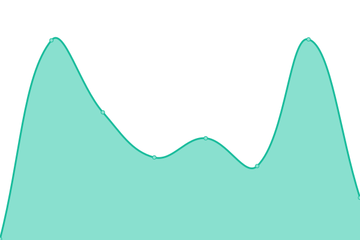
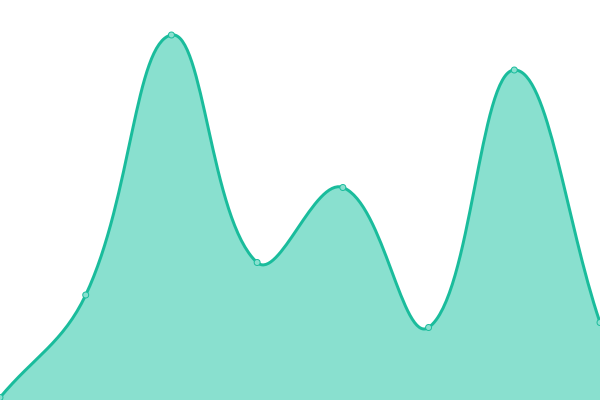

# [📈 Live Status](https://upptime.github.io/upptime): <!--live status--> **All systems are operational 🥳 🎉**

This repository contains the open-source uptime monitor and status page for [Upptime](https://upptime.js.org), powered by [Upptime](https://github.com/upptime/upptime).

With [Upptime](https://upptime.js.org), you can get your own unlimited and free uptime monitor and status page, powered entirely by a GitHub repository. We use [Issues](https://github.com/upptime/upptime/issues) as incident reports, [Actions](https://github.com/parikshit-parspec/upptime/actions) as uptime monitors, and [Pages](https://upptime.github.io/upptime) for the status page.

<!--start: status pages-->
<!-- This summary is generated by Upptime (https://github.com/upptime/upptime) -->
<!-- Do not edit this manually, your changes will be overwritten -->
<!-- prettier-ignore -->
| URL | Status | History | Response Time | Uptime |
| --- | ------ | ------- | ------------- | ------ |
|  [app.parspec.io](https://app.parspec.io/) | 🟩 Up | [app-parspec-io.yml](https://github.com/parikshit-parspec/upptime/commits/HEAD/history/app-parspec-io.yml) | 

 216ms
     
 | 

<a href="https://parikshit-parspec.github.io/upptime/history/app-parspec-io">100.00%</a>
    

|  [review.parspec.io](https://review.parspec.io/) | 🟩 Up | [review-parspec-io.yml](https://github.com/parikshit-parspec/upptime/commits/HEAD/history/review-parspec-io.yml) | 

 244ms
     
 | 

<a href="https://parikshit-parspec.github.io/upptime/history/review-parspec-io">100.00%</a>
    

|  [api.parspec.io](https://api.parspec.io/health) | 🟩 Up | [api-parspec-io.yml](https://github.com/parikshit-parspec/upptime/commits/HEAD/history/api-parspec-io.yml) | 

 236ms
     
 | 

<a href="https://parikshit-parspec.github.io/upptime/history/api-parspec-io">100.00%</a>
    

|  [wvproxy.parspec.io](http://wvproxy.parspec.io/) | 🟩 Up | [wvproxy-parspec-io.yml](https://github.com/parikshit-parspec/upptime/commits/HEAD/history/wvproxy-parspec-io.yml) | 

 310ms
     
 | 

<a href="https://parikshit-parspec.github.io/upptime/history/wvproxy-parspec-io">100.00%</a>
    

|  [search.parspec.io](https://search.parspec.io/health) | 🟩 Up | [search-parspec-io.yml](https://github.com/parikshit-parspec/upptime/commits/HEAD/history/search-parspec-io.yml) | 

 198ms
     
 | 

<a href="https://parikshit-parspec.github.io/upptime/history/search-parspec-io">100.00%</a>
    

|  [parspec-prod-IM-UIUX-1](http://ec2-18-118-184-166.us-east-2.compute.amazonaws.com/health) | 🟩 Up | [parspec-prod-im-uiux-1.yml](https://github.com/parikshit-parspec/upptime/commits/HEAD/history/parspec-prod-im-uiux-1.yml) | 

 649ms
     
 | 

<a href="https://parikshit-parspec.github.io/upptime/history/parspec-prod-im-uiux-1">100.00%</a>
    

|  [parspec-prod-IM-UIUX-2](http://ec2-18-219-180-248.us-east-2.compute.amazonaws.com/health) | 🟩 Up | [parspec-prod-im-uiux-2.yml](https://github.com/parikshit-parspec/upptime/commits/HEAD/history/parspec-prod-im-uiux-2.yml) | 

 91ms
     
 | 

<a href="https://parikshit-parspec.github.io/upptime/history/parspec-prod-im-uiux-2">100.00%</a>
    

|  [parspec-prod-IM-UIUX-3](http://ec2-3-136-159-131.us-east-2.compute.amazonaws.com/health) | 🟩 Up | [parspec-prod-im-uiux-3.yml](https://github.com/parikshit-parspec/upptime/commits/HEAD/history/parspec-prod-im-uiux-3.yml) | 

 92ms
     
 | 

<a href="https://parikshit-parspec.github.io/upptime/history/parspec-prod-im-uiux-3">100.00%</a>
    

|  [parspec-prod-IM-UIUX-4](http://ec2-18-218-119-23.us-east-2.compute.amazonaws.com/health) | 🟩 Up | [parspec-prod-im-uiux-4.yml](https://github.com/parikshit-parspec/upptime/commits/HEAD/history/parspec-prod-im-uiux-4.yml) | 

 185ms
     
 | 

<a href="https://parikshit-parspec.github.io/upptime/history/parspec-prod-im-uiux-4">100.00%</a>
    

|  [parspec-hubspot-prod](http://ec2-13-58-13-16.us-east-2.compute.amazonaws.com/health) | 🟩 Up | [parspec-hubspot-prod.yml](https://github.com/parikshit-parspec/upptime/commits/HEAD/history/parspec-hubspot-prod.yml) | 

 98ms
     
 | 

<a href="https://parikshit-parspec.github.io/upptime/history/parspec-hubspot-prod">100.00%</a>
    

|  [parspec-deep-learning-inference-GPU](http://18.220.81.130:8501/v1/models/bert_v3:predict) | 🟩 Up | [parspec-deep-learning-inference-gpu.yml](https://github.com/parikshit-parspec/upptime/commits/HEAD/history/parspec-deep-learning-inference-gpu.yml) | 

 116ms
     
 | 

<a href="https://parikshit-parspec.github.io/upptime/history/parspec-deep-learning-inference-gpu">100.00%</a>
    

|  [ej2.parspec.io](https://ej2.parspec.io/health) | 🟩 Up | [ej2-parspec-io.yml](https://github.com/parikshit-parspec/upptime/commits/HEAD/history/ej2-parspec-io.yml) | 

 218ms
     
 | 

<a href="https://parikshit-parspec.github.io/upptime/history/ej2-parspec-io">100.00%</a>
    

|  [aggregator](http://18.191.102.64/health) | 🟩 Up | [aggregator.yml](https://github.com/parikshit-parspec/upptime/commits/HEAD/history/aggregator.yml) | 

 73ms
     
 | 

<a href="https://parikshit-parspec.github.io/upptime/history/aggregator">100.00%</a>
    

<!--end: status pages-->

[**Visit our status website →**](https://upptime.github.io/upptime)

## 📄 License

- Powered by: [Upptime](https://github.com/upptime/upptime)
- Code: [MIT](./LICENSE) © [Upptime](https://upptime.js.org)
- Data in the `./history` directory: [Open Database License](https://opendatacommons.org/licenses/odbl/1-0/)
