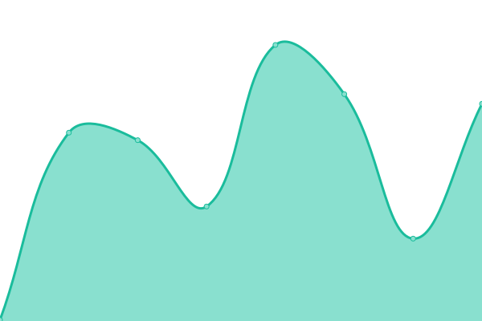
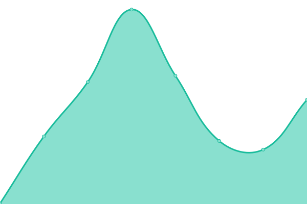
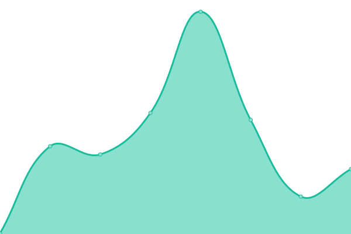
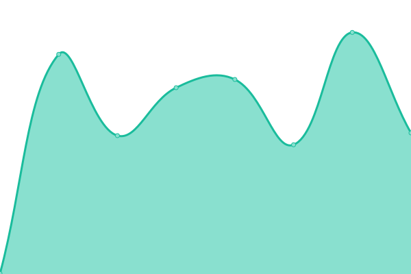
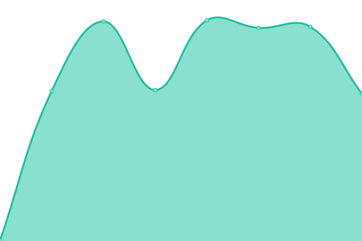
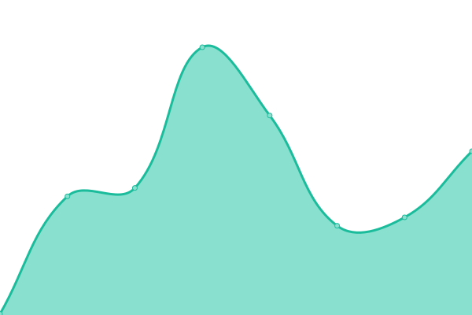
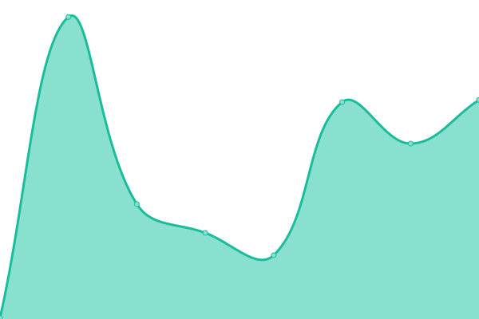
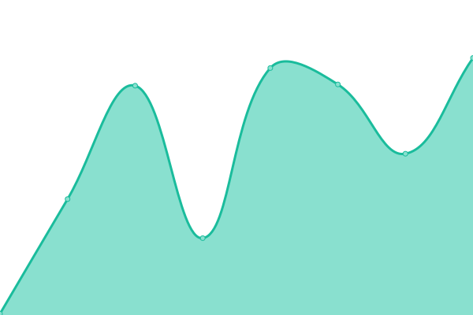
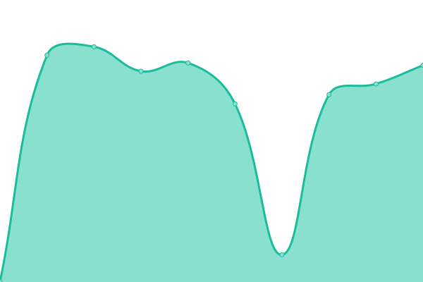
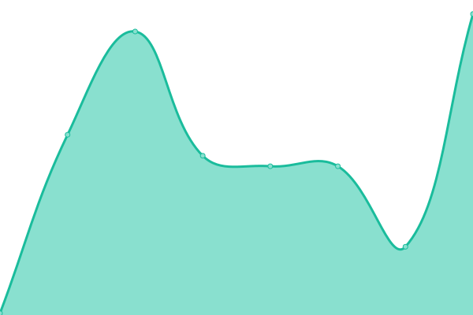

# [📈 Live Status](https://upptime.github.io/upptime): <!--live status--> **🟧 Partial outage**

This repository contains the open-source uptime monitor and status page for [Upptime](https://upptime.js.org), powered by [Upptime](https://github.com/upptime/upptime).

With [Upptime](https://upptime.js.org), you can get your own unlimited and free uptime monitor and status page, powered entirely by a GitHub repository. We use [Issues](https://github.com/upptime/upptime/issues) as incident reports, [Actions](https://github.com/parikshit-parspec/upptime/actions) as uptime monitors, and [Pages](https://upptime.github.io/upptime) for the status page.

<!--start: status pages-->
<!-- This summary is generated by Upptime (https://github.com/upptime/upptime) -->
<!-- Do not edit this manually, your changes will be overwritten -->
<!-- prettier-ignore -->
| URL | Status | History | Response Time | Uptime |
| --- | ------ | ------- | ------------- | ------ |
|  [app.parspec.io](https://app.parspec.io/) | 🟩 Up | [app-parspec-io.yml](https://github.com/parikshit-parspec/upptime/commits/HEAD/history/app-parspec-io.yml) | 

 185ms
     
 | 

<a href="https://parikshit-parspec.github.io/upptime/history/app-parspec-io">100.00%</a>
    

|  [review.parspec.io](https://review.parspec.io/) | 🟩 Up | [review-parspec-io.yml](https://github.com/parikshit-parspec/upptime/commits/HEAD/history/review-parspec-io.yml) | 

 209ms
     
 | 

<a href="https://parikshit-parspec.github.io/upptime/history/review-parspec-io">100.00%</a>
    

|  [api.parspec.io](https://api.parspec.io/health) | 🟩 Up | [api-parspec-io.yml](https://github.com/parikshit-parspec/upptime/commits/HEAD/history/api-parspec-io.yml) | 

 306ms
     
 | 

<a href="https://parikshit-parspec.github.io/upptime/history/api-parspec-io">100.00%</a>
    

|  [wvproxy.parspec.io](http://wvproxy.parspec.io/marco) | 🟩 Up | [wvproxy-parspec-io.yml](https://github.com/parikshit-parspec/upptime/commits/HEAD/history/wvproxy-parspec-io.yml) | 

 441ms
     
 | 

<a href="https://parikshit-parspec.github.io/upptime/history/wvproxy-parspec-io">100.00%</a>
    

|  [search.parspec.io](https://search.parspec.io/health) | 🟩 Up | [search-parspec-io.yml](https://github.com/parikshit-parspec/upptime/commits/HEAD/history/search-parspec-io.yml) | 

 233ms
     
 | 

<a href="https://parikshit-parspec.github.io/upptime/history/search-parspec-io">100.00%</a>
    

|  [sonic](https://api.parspec.io/marco) | 🟩 Up | [sonic.yml](https://github.com/parikshit-parspec/upptime/commits/HEAD/history/sonic.yml) | 

 33ms
     
 | 

<a href="https://parikshit-parspec.github.io/upptime/history/sonic">100.00%</a>
    

|  [arc](https://arc.parspec.io/marco) | 🟩 Up | [arc.yml](https://github.com/parikshit-parspec/upptime/commits/HEAD/history/arc.yml) | 

 215ms
     
 | 

<a href="https://parikshit-parspec.github.io/upptime/history/arc">100.00%</a>
    

|  [row-detection](http://row-detect.parspec.io/v1/models/header_detection:predict) | 🟩 Up | [row-detection.yml](https://github.com/parikshit-parspec/upptime/commits/HEAD/history/row-detection.yml) | 

 346ms
     
 | 

<a href="https://parikshit-parspec.github.io/upptime/history/row-detection">100.00%</a>
    

|  [col-detection](http:/col-detect.parspec.io/v1/models/col_detection:predict) | 🟩 Up | [col-detection.yml](https://github.com/parikshit-parspec/upptime/commits/HEAD/history/col-detection.yml) | 

 341ms
     
 | 

<a href="https://parikshit-parspec.github.io/upptime/history/col-detection">100.00%</a>
    

|  [pdf-attr-extraction](https://ai-prod.parspec-cp.io/health) | 🟩 Up | [pdf-attr-extraction.yml](https://github.com/parikshit-parspec/upptime/commits/HEAD/history/pdf-attr-extraction.yml) | 

 1336ms
     
 | 

<a href="https://parikshit-parspec.github.io/upptime/history/pdf-attr-extraction">99.81%</a>
    

|  [ej2.parspec.io](https://ej2.parspec.io/health) | 🟩 Up | [ej2-parspec-io.yml](https://github.com/parikshit-parspec/upptime/commits/HEAD/history/ej2-parspec-io.yml) | 

 238ms
     
 | 

<a href="https://parikshit-parspec.github.io/upptime/history/ej2-parspec-io">100.00%</a>
    

|  [parspec-hubspot-prod](https://hubspot.parspec.io/health) | 🟩 Up | [parspec-hubspot-prod.yml](https://github.com/parikshit-parspec/upptime/commits/HEAD/history/parspec-hubspot-prod.yml) | 

 683ms
     
 | 

<a href="https://parikshit-parspec.github.io/upptime/history/parspec-hubspot-prod">100.00%</a>
    

|  [FE events](https://fe-event-service.parspec.io/healthz) | 🟩 Up | [fe-events.yml](https://github.com/parikshit-parspec/upptime/commits/HEAD/history/fe-events.yml) | 

 169ms
     
 | 

<a href="https://parikshit-parspec.github.io/upptime/history/fe-events">100.00%</a>
    

|  [Office proxy](https://proxy.perryizgr8.com/health) | 🟥 Down | [office-proxy.yml](https://github.com/parikshit-parspec/upptime/commits/HEAD/history/office-proxy.yml) | 

 751ms
     
 | 

<a href="https://parikshit-parspec.github.io/upptime/history/office-proxy">99.75%</a>
    

|  [🤖 AI dev GCP mn-to-att:electrical](http://34.69.72.72/health_ai) | 🟩 Up | [ai-dev-gcp-mn-to-att-electrical.yml](https://github.com/parikshit-parspec/upptime/commits/HEAD/history/ai-dev-gcp-mn-to-att-electrical.yml) | 

 106ms
     
 | 

<a href="https://parikshit-parspec.github.io/upptime/history/ai-dev-gcp-mn-to-att-electrical">100.00%</a>
    

<!--end: status pages-->

[**Visit our status website →**](https://upptime.github.io/upptime)

## 📄 License

- Powered by: [Upptime](https://github.com/upptime/upptime)
- Code: [MIT](./LICENSE) © [Upptime](https://upptime.js.org)
- Data in the `./history` directory: [Open Database License](https://opendatacommons.org/licenses/odbl/1-0/)
