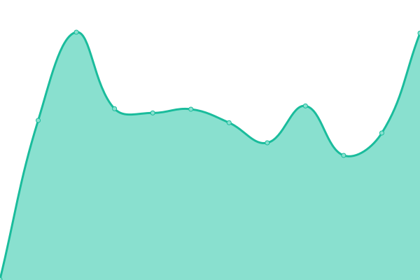

# [📈 Live Status](https://upptime.github.io/upptime): <!--live status--> **🟩 All systems operational**

This repository contains the open-source uptime monitor and status page for [Upptime](https://upptime.js.org), powered by [Upptime](https://github.com/upptime/upptime).

With [Upptime](https://upptime.js.org), you can get your own unlimited and free uptime monitor and status page, powered entirely by a GitHub repository. We use [Issues](https://github.com/upptime/upptime/issues) as incident reports, [Actions](https://github.com/parikshit-parspec/upptime/actions) as uptime monitors, and [Pages](https://upptime.github.io/upptime) for the status page.

<!--start: status pages-->
<!-- This summary is generated by Upptime (https://github.com/upptime/upptime) -->
<!-- Do not edit this manually, your changes will be overwritten -->
<!-- prettier-ignore -->
| URL | Status | History | Response Time | Uptime |
| --- | ------ | ------- | ------------- | ------ |
|  [parspec.io](https://parspec.io/) | 🟩 Up | [parspec-io.yml](https://github.com/parikshit-parspec/upptime/commits/HEAD/history/parspec-io.yml) | 

 290ms
     
 | 

<a href="https://parikshit-parspec.github.io/upptime/history/parspec-io">100.00%</a>
    

|  [app.parspec.io](https://app.parspec.io/) | 🟩 Up | [app-parspec-io.yml](https://github.com/parikshit-parspec/upptime/commits/HEAD/history/app-parspec-io.yml) | 

 231ms
     
 | 

<a href="https://parikshit-parspec.github.io/upptime/history/app-parspec-io">100.00%</a>
    

|  [api.parspec.io](https://api.parspec.io/admin/) | 🟩 Up | [api-parspec-io.yml](https://github.com/parikshit-parspec/upptime/commits/HEAD/history/api-parspec-io.yml) | 

 276ms
     
 | 

<a href="https://parikshit-parspec.github.io/upptime/history/api-parspec-io">100.00%</a>
    

|  [wvproxy.parspec.io](http://wvproxy.parspec.io/) | 🟩 Up | [wvproxy-parspec-io.yml](https://github.com/parikshit-parspec/upptime/commits/HEAD/history/wvproxy-parspec-io.yml) | 

 268ms
     
 | 

<a href="https://parikshit-parspec.github.io/upptime/history/wvproxy-parspec-io">100.00%</a>
    

|  [search.parspec.io](https://search.parspec.io/admin/) | 🟩 Up | [search-parspec-io.yml](https://github.com/parikshit-parspec/upptime/commits/HEAD/history/search-parspec-io.yml) | 

 246ms
     
 | 

<a href="https://parikshit-parspec.github.io/upptime/history/search-parspec-io">100.00%</a>
    

<!--end: status pages-->

[**Visit our status website →**](https://upptime.github.io/upptime)

## 📄 License

- Powered by: [Upptime](https://github.com/upptime/upptime)
- Code: [MIT](./LICENSE) © [Upptime](https://upptime.js.org)
- Data in the `./history` directory: [Open Database License](https://opendatacommons.org/licenses/odbl/1-0/)
