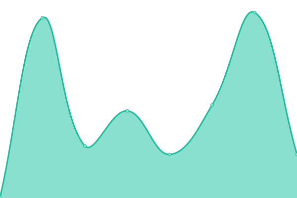
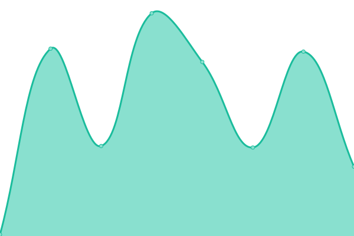
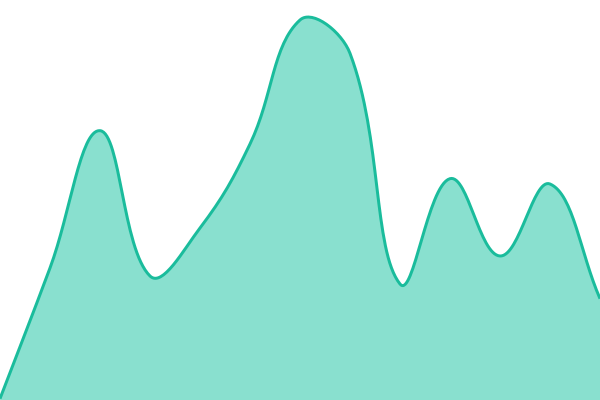
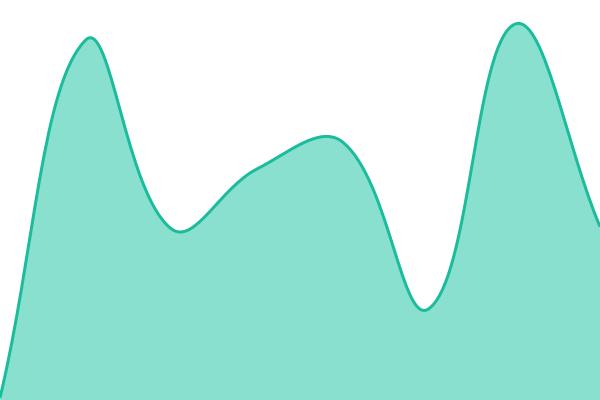
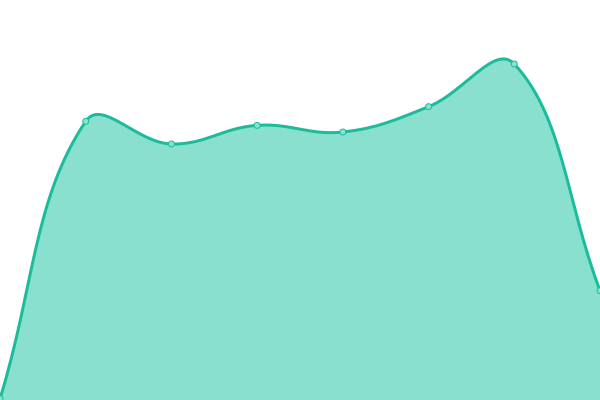
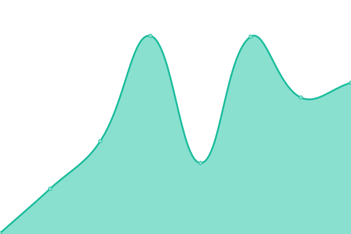
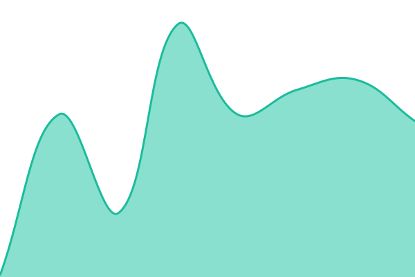

# [📈 Live Status](https://upptime.github.io/upptime): <!--live status--> **🟧 Partial outage**

This repository contains the open-source uptime monitor and status page for [Upptime](https://upptime.js.org), powered by [Upptime](https://github.com/upptime/upptime).

With [Upptime](https://upptime.js.org), you can get your own unlimited and free uptime monitor and status page, powered entirely by a GitHub repository. We use [Issues](https://github.com/upptime/upptime/issues) as incident reports, [Actions](https://github.com/parikshit-parspec/upptime/actions) as uptime monitors, and [Pages](https://upptime.github.io/upptime) for the status page.

<!--start: status pages-->
<!-- This summary is generated by Upptime (https://github.com/upptime/upptime) -->
<!-- Do not edit this manually, your changes will be overwritten -->
<!-- prettier-ignore -->
| URL | Status | History | Response Time | Uptime |
| --- | ------ | ------- | ------------- | ------ |
|  [app.parspec.io](https://app.parspec.io/) | 🟩 Up | [app-parspec-io.yml](https://github.com/parikshit-parspec/upptime/commits/HEAD/history/app-parspec-io.yml) | 

 91ms
     
 | 

<a href="https://parikshit-parspec.github.io/upptime/history/app-parspec-io">100.00%</a>
    

|  [review.parspec.io](https://review.parspec.io/) | 🟩 Up | [review-parspec-io.yml](https://github.com/parikshit-parspec/upptime/commits/HEAD/history/review-parspec-io.yml) | 

 64ms
     
 | 

<a href="https://parikshit-parspec.github.io/upptime/history/review-parspec-io">100.00%</a>
    

|  [api.parspec.io](https://api.parspec.io/health) | 🟥 Down | [api-parspec-io.yml](https://github.com/parikshit-parspec/upptime/commits/HEAD/history/api-parspec-io.yml) | 

 167ms
     
 | 

<a href="https://parikshit-parspec.github.io/upptime/history/api-parspec-io">97.11%</a>
    

|  [wvproxy.parspec.io](http://wvproxy.parspec.io/marco) | 🟥 Down | [wvproxy-parspec-io.yml](https://github.com/parikshit-parspec/upptime/commits/HEAD/history/wvproxy-parspec-io.yml) | 

 322ms
     
 | 

<a href="https://parikshit-parspec.github.io/upptime/history/wvproxy-parspec-io">97.41%</a>
    

|  [sonic](https://api.parspec.io/marco) | 🟥 Down | [sonic.yml](https://github.com/parikshit-parspec/upptime/commits/HEAD/history/sonic.yml) | 

 152ms
     
 | 

<a href="https://parikshit-parspec.github.io/upptime/history/sonic">97.72%</a>
    

|  [arc](https://arc.parspec.io/marco) | 🟩 Up | [arc.yml](https://github.com/parikshit-parspec/upptime/commits/HEAD/history/arc.yml) | 

 208ms
     
 | 

<a href="https://parikshit-parspec.github.io/upptime/history/arc">100.00%</a>
    

|  [ej2.parspec.io](https://ej2.parspec.io/health) | 🟥 Down | [ej2-parspec-io.yml](https://github.com/parikshit-parspec/upptime/commits/HEAD/history/ej2-parspec-io.yml) | 

 223ms
     
 | 

<a href="https://parikshit-parspec.github.io/upptime/history/ej2-parspec-io">98.03%</a>
    

|  [parspec-hubspot-prod](https://hubspot.parspec.io/health) | 🟩 Up | [parspec-hubspot-prod.yml](https://github.com/parikshit-parspec/upptime/commits/HEAD/history/parspec-hubspot-prod.yml) | 

 343ms
     
 | 

<a href="https://parikshit-parspec.github.io/upptime/history/parspec-hubspot-prod">100.00%</a>
    

|  [FE events](https://fe-event-service.parspec.io/healthz) | 🟥 Down | [fe-events.yml](https://github.com/parikshit-parspec/upptime/commits/HEAD/history/fe-events.yml) | 

 158ms
     
 | 

<a href="https://parikshit-parspec.github.io/upptime/history/fe-events">98.34%</a>
    

|  [🔌 parspec connector](https://apim.workato.com/parspecdev/connector-health-vv1/parspec-connector) | 🟥 Down | [parspec-connector.yml](https://github.com/parikshit-parspec/upptime/commits/HEAD/history/parspec-connector.yml) | 

 680ms
     
 | 

<a href="https://parikshit-parspec.github.io/upptime/history/parspec-connector">98.64%</a>
    

|  [Inventory Service](https://inventory.parspec.io/inventory-service/marco) | 🟩 Up | [inventory-service.yml](https://github.com/parikshit-parspec/upptime/commits/HEAD/history/inventory-service.yml) | 

 185ms
     
 | 

<a href="https://parikshit-parspec.github.io/upptime/history/inventory-service">100.00%</a>
    

|  [Platform API service(Production)](https://platform.parspec.io/platform-api/api/v1/marco) | 🟥 Down | [platform-api-service-production.yml](https://github.com/parikshit-parspec/upptime/commits/HEAD/history/platform-api-service-production.yml) | 

 165ms
     
 | 

<a href="https://parikshit-parspec.github.io/upptime/history/platform-api-service-production">98.95%</a>
    

|  [Ingestion service(Production)](https://platform.parspec.io/ingestion-service/api/v1/marco) | 🟥 Down | [ingestion-service-production.yml](https://github.com/parikshit-parspec/upptime/commits/HEAD/history/ingestion-service-production.yml) | 

 156ms
     
 | 

<a href="https://parikshit-parspec.github.io/upptime/history/ingestion-service-production">99.37%</a>
    

|  [Platform API service(Staging)](https://platform.parspec.xyz/platform-api/api/v1/marco) | 🟥 Down | [platform-api-service-staging.yml](https://github.com/parikshit-parspec/upptime/commits/HEAD/history/platform-api-service-staging.yml) | 

 181ms
     
 | 

<a href="https://parikshit-parspec.github.io/upptime/history/platform-api-service-staging">99.95%</a>
    

|  [Ingestion service(Staging)](https://platform.parspec.xyz/ingestion-service/api/v1/marco) | 🟥 Down | [ingestion-service-staging.yml](https://github.com/parikshit-parspec/upptime/commits/HEAD/history/ingestion-service-staging.yml) | 

 166ms
     
 | 

<a href="https://parikshit-parspec.github.io/upptime/history/ingestion-service-staging">99.99%</a>
    

<!--end: status pages-->

[**Visit our status website →**](https://upptime.github.io/upptime)

## 📄 License

- Powered by: [Upptime](https://github.com/upptime/upptime)
- Code: [MIT](./LICENSE) © [Upptime](https://upptime.js.org)
- Data in the `./history` directory: [Open Database License](https://opendatacommons.org/licenses/odbl/1-0/)
